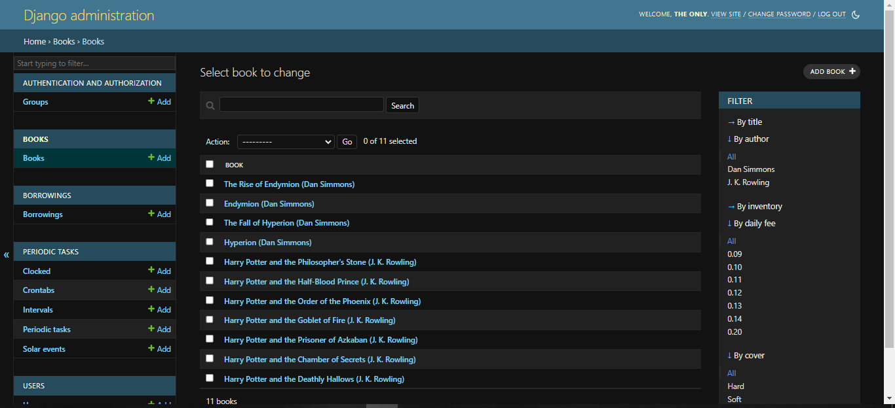
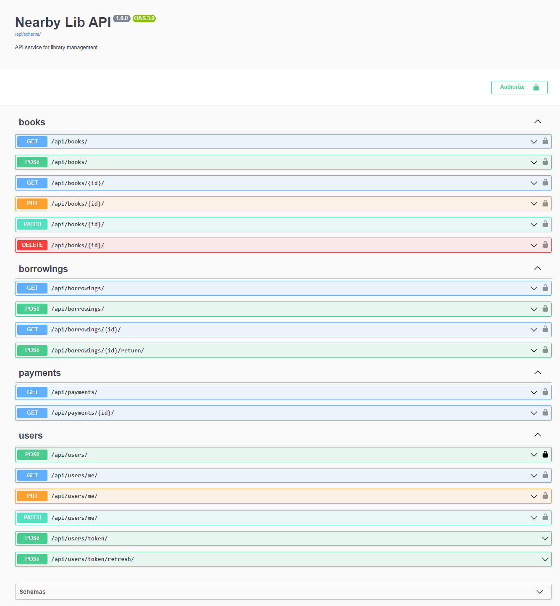

# Nearby Lib API 
___
#### My API service provides functionality for efficiently managing a Library's book borrowing services. The Nearby Lib API management system is developed using Python and Django Rest Framework to deliver reliable backend solutions and robust API functionality. To ensure optimal data management,  PostgreSQL was chosen as preferred database. This design aligns with the latest technologies and adheres to industry best practices. Please feel free to give it a try!

## 🔧 Technologies used:
___
* [X] Django Rest Framework
* [X] PostgreSQL
* [X] TelegramBotAPI
* [X] Redis
* [X] Celery
* [X] Flower 
* [X] Docker

# 🧾 Features
___
* [X] JWT authentication 🔒
* [X] Telegram notification for borrowing creation, returning or overdue
* [X] CRUD functionality for Books Service and Users Service
* [X] Filtering Borrowings by is_active for standard users and by (is_active, user_id) for admin user
* [X] Creating, updating and deleting books only for admin users
* [X] Customizable automatic tasks for Borrowings overdue monitoring
* [X] Django Admin panel with opportunity of further customization
* [X] Detailed Documentation on /api/doc/swagger/ or /api/doc/redoc/
* [X] Totally Dockerized

### 💾 Installation:
___
#### 1. Clone the repository:
```shell
git clone https://github.com/bohdan-yatsyna/Nearby-Lib-API.git
cd Nearby-Lib-API
```
#### 2. Create and activate virtual environment with requirements install:
🖥 Windows:
```shell
python -m venv venv
venv\Scripts\activate
```
💻 Linux/MacOS:
```shell
python -m venv venv
source venv/bin/activate
```
#### 3. 🗝 Set up environment variables (using .env):
- Create an empty .env file in the root folder of the project.
- Copy the entire content of the .env.sample to your .env file.
- Modify the placeholders in the .env file with your preferable environment variables.

#### 4. 🐳 Run it with DOCKER:
- DOCKER should be installed and opened.
```shell
docker-compose up --build
```
- And open in your browser "http://127.0.0.1:8000/"

#### 🗝 For creating admin user:  
- Check actual container id of the application with ```docker ps```  
- Enter it to the next command and run ```docker exec -it <container_id> python manage.py createsuperuser```  

#### 🗝 For creating standard user next endpoints will help:  
- **User creating** - send a POST request to /api/users/  
- **Obtain token** - send a POST request to /api/users/token/

#### 🗝 For Authorization:
- Install **ModHeader** extension and create Request header "Authorize" with value: Bearer &lt;Your access token&gt;

#### 5. For Telegram notification functionality usage: 
- Create Telegram bot using @BotFather.
- Update .env with your &lt;TELEGRAM_BOT_TOKEN&gt; and &lt;TELEGRAM_CHAT_ID&gt;

# 🕶 DEMO
### Admin pannel:


### Documentation with all endpoints:


